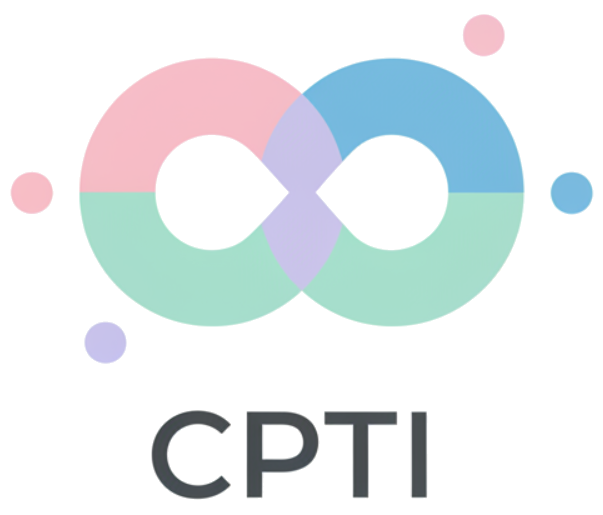
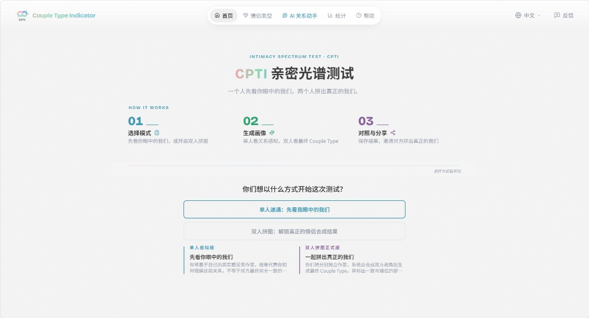
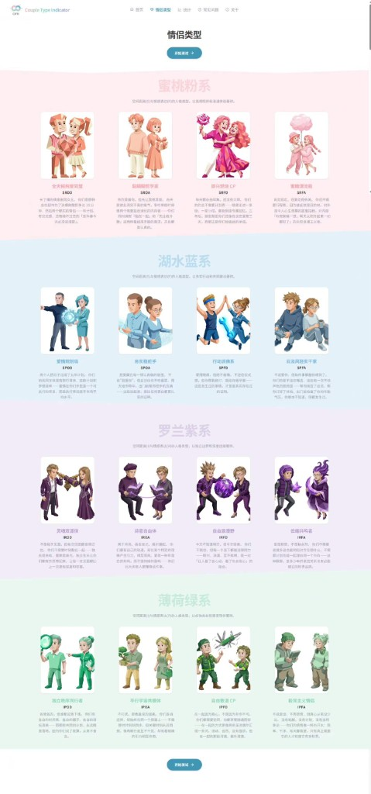
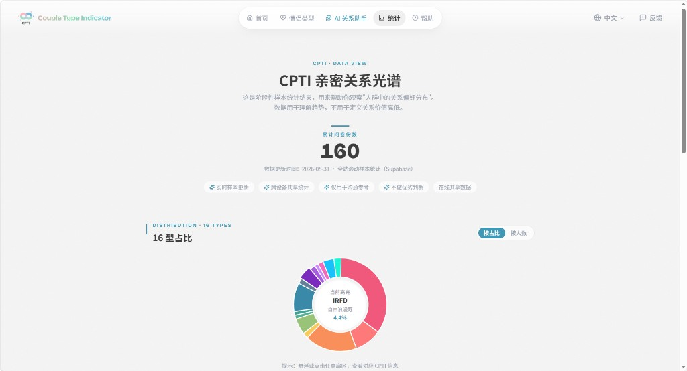

<p align="center">
  
</p>

<h1 align="center">CPTI · 亲密光谱测试</h1>

<p align="center">
  <strong>在 16 种爱情的颜色里，找到属于你们的那一抹光。</strong>
</p>

<p align="center">
  专为情侣设计的关系测评 —— 测的不是「你是谁」，而是「你们怎么相处」。
</p>

<!-- README-I18N:START -->

<p align="center">
  <strong>汉语</strong> · <a href="./README.en.md">English</a>
</p>

<!-- README-I18N:END -->

<p align="center">
  
  
  
  <a href="https://www.cpti.site"></a>
</p>

<p align="center">
  <a href="#这是什么">概览</a>
  ·
  <a href="#为什么有意思">亮点</a>
  ·
  <a href="#怎么玩">怎么玩</a>
  ·
  <a href="#产品一览">产品一览</a>
  ·
  <a href="#适合谁">适合谁</a>
  ·
  <a href="#本地跑起来可选">本地运行</a>
  ·
  <a href="https://www.cpti.site">线上体验</a>
</p>

<br />

<p align="center">
  
</p>

---

## 这是什么？

市面上的人格测试大多围绕「个人」——你是内向还是外向、你喜欢计划还是随性。  
**CPTI 换了一个最小单位：关系本身。**

通过 32 道生活化情境题，它帮情侣看见彼此的相处模式：黏还是需要空间、偏浪漫还是偏务实、爱计划还是随性、冲突时直球还是先冷静。  
最终生成一份可分享的「亲密光谱报告」——像一面镜子，不评判好坏，只帮你们把感觉说清楚。

> [!TIP]
> 一个人先测，也能先看见「我眼中的我们」；邀请对方一起拼图，才能解锁真正的情侣合成结果。

---

## 为什么有意思？

| 亮点 | 一句话 |
|------|--------|
| **测关系，不贴个人标签** | 关注相处方式，而不是给某一方下定论 |
| **单人速通 + 双人拼图** | 可以先自己看，也可以两人独立作答再合成 |
| **16 种情侣类型 · 四大色系** | 蜜桃粉、湖水蓝、罗兰紫、薄荷绿，好记也好晒 |
| **结果可分享** | 报告适合截图、发朋友圈、发给 TA |
| **AI 关系助手** | 带着你们的结果聊具体问题，而不是空泛鸡汤 |
| **不做对错评判** | 只提供共同语言，方便继续沟通 |

---

## 怎么玩？

三步就够：

1. **选模式** — 单人速通先看自己的视角，或双人拼图邀请对方一起完成  
2. **答 32 道情境题** — 都是日常相处里会碰到的小事，按真实感受选即可  
3. **看报告、对照、分享** — 保存结果，或把链接发给 TA，拼出更完整的「我们」

双人拼图时，你们会各自独立作答；系统再把两边视角合在一起，标出**最合拍**和**最容易错位**的地方——适合当作一次轻松的对照，而不是考试打分。

---

## 产品一览

### 16 种情侣类型

四条相处光谱交叉组合，落成 16 种类型，并按色系分组，方便记忆和传播。

<p align="center">
  
</p>

四条光谱大致是：

- **空间** — 更黏，还是更需要边界  
- **表达** — 偏仪式与浪漫，还是偏务实行动  
- **节奏** — 爱计划，还是更随性  
- **冲突** — 当场直球沟通，还是先冷静再谈  

### AI 关系助手

测完之后，可以带着你们的类型、光谱和冲突模式，和助手聊具体情境——比如「总因为临时改计划吵架怎么办」。  
它会基于**当前这份结果**给建议，而不是一套通用说教。

<p align="center">
  
</p>

> 对话记录只留在你当前的浏览器里；发给助手的也只是必要的关系摘要，不会把昵称和逐题答案整包上传。

### 大家的光谱长什么样？

统计页会汇总匿名测评样本，让你看看自己的类型在人群里大概落在哪——同样只作观察参考，不作好坏排序。

<p align="center">
  
</p>

上线初期，单篇小红书笔记自然浏览曾到 3200+，并沉淀 150+ 份真实测评样本——说明「测完想分享」这件事是成立的。

---

## 适合谁？

- 想和伴侣用轻松方式对照相处模式的情侣  
- 好奇「我眼中的我们」和「真正的我们」差多少的人  
- 需要一份好晒、好聊的关系报告的朋友  

> [!NOTE]
> CPTI 是沟通与自我探索的小工具，**不是**心理诊断或医疗建议。结果用来开启对话，而不是给关系下最终判决。

---

## 本地跑起来（可选）

想在自己电脑上打开这份项目：

```bash
npm install
npm run dev
```

浏览器访问终端里提示的本地地址即可。完整产品说明见 [`cpti_prd.md`](./cpti_prd.md)。

若需要接上统计、双人邀请或 AI 助手等线上能力，复制 `.env.example` 为 `.env.local`，按文件里的说明填入配置后再部署即可。

---

## 技术一瞥

前端用 React + Vite 搭建，手机和电脑都能用；动画与结果页侧重「好读、好分享」。  
需要存统计、邀请或对话时，走轻量服务端能力；日常答题与出结果尽量在前端完成，减少等待感。

更细的实现与接口说明，请直接看源码与 [`cpti_prd.md`](./cpti_prd.md)——这份 README 刻意把产品讲清楚，把工程细节留给代码。

---

<p align="center">
  <a href="https://www.cpti.site"><strong>去测一次 → www.cpti.site</strong></a>
</p>
